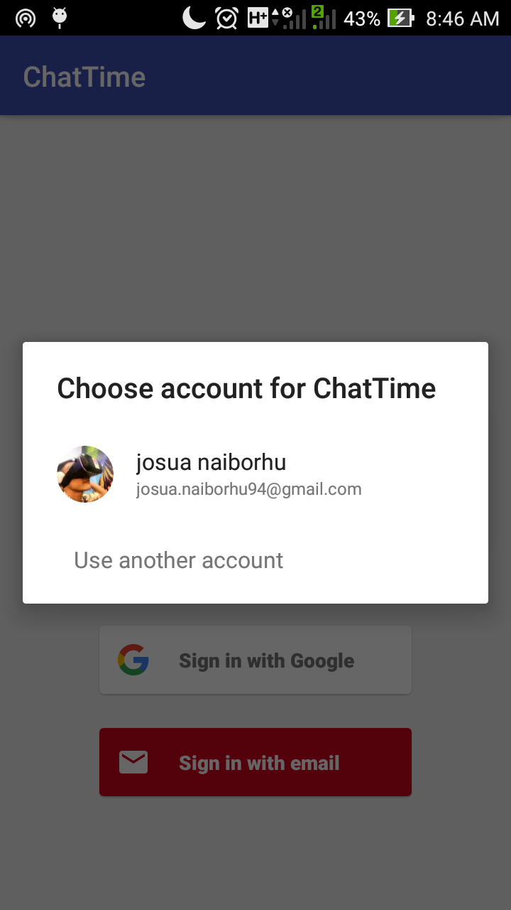
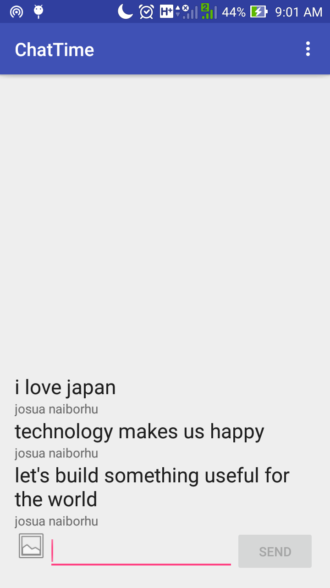

# ChatTime
An Aplication for showing how to implement about using Firebase for RealTime Database
The App using Firebase for getting and delivering message about the transaction of output such as messages and images.

## Install
```
Download [Android Studio](https://developer.android.com/studio/index.html) for building mobile application
```
The Flow of the Program



## Create Firebase Account

Create account on [Firebase](https://firebase.google.com/) for building RealTime Database

Import the project

Make the configuration

## Features
```
1. Sending  Realtime Images and Messages
```
```
2. Automatically Synchronized to the Social media
```

## Future Features
```
1. Interaction between among users
```
